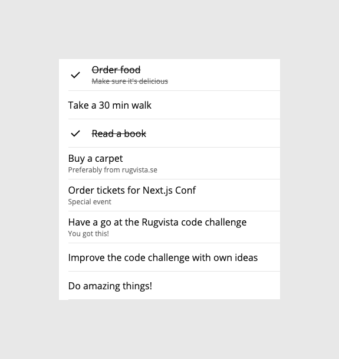

# Rugvista Frontend Code Challenge :memo:

First things first, this challenge is **not** about right and wrong. The main goal is to show us your thought process.

So, the challenge is that you need to create a todo list. :sleeping: The data should live outside, preferably with a context, and each item should be toggleable, the mock below should clear things up.

## Mock



```
{
  "items": [
    {
      "id": 1,
      "title": "Order food",
      "subtitle": "Make sure it's delicious"
    },
    {
      "id": 2,
      "title": "Take a 30 min walk"
    },
    {
      "id": 3,
      "title": "Read a book"
    },
    {
      "id": 4,
      "title": "Buy a carpet",
      "subtitle": "Preferably from rugvista.se"
    },
    {
      "id": 5,
      "title": "Order tickets for Next.js Conf",
      "subtitle": "Special event"
    },
    {
      "id": 6,
      "title": "Have a go at the Rugvista code challenge",
      "subtitle": "You got this!"
    },
    {
      "id": 7,
      "title": "Improve the code challenge with own ideas"
    },
    {
      "id": 8,
      "title": "Do amazing things!"
    }
  ]
}
```

## Things to consider

- Choose whatever libraries you like but the Rugvista frontend team really likes [Next.js](https://nextjs.org/) and [Styled Components](https://styled-components.com/).
- Features change, is the code easy to reuse or develop any further?
- If a new colleague joins the team, does he/she understand how to use the code?
- Can anything be improved? What if the "checked" property is added to the data?
- Take the time you need! We rather review code that is ready for production (ish) than stressed code.

## Deliver

Please send us a link to your repo and it's totally fine if it's private, just make sure you add `tkorsback` as a member.

Happy coding! :wave:
